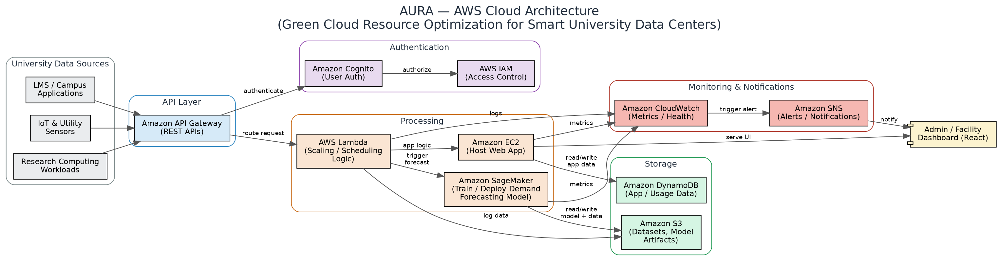
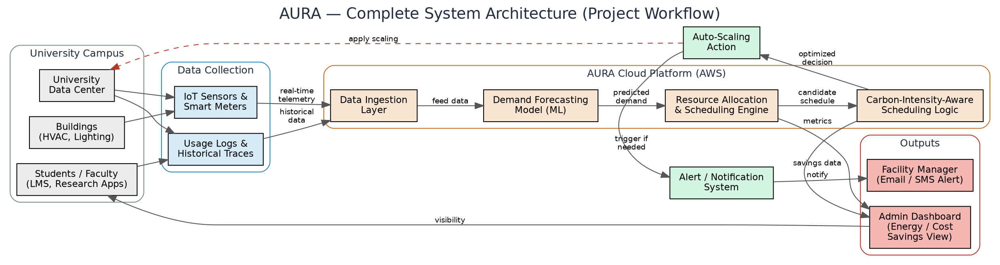

# AURA — Autonomous University Resource Allocator

> **Course:** BCSE355L — Cloud Architecture Design
> **Instructor:** Dr. Priya V
> **Academic Year:** 2025–2026

---

## Project Title

**AURA — Autonomous University Resource Allocator: Green Cloud Resource Optimization for Smart University Data Centers**

---

## Team Members

| Reg. No. | Name | Role | Primary Responsibilities |
|---|---|---|---|
| 24BIT0537 | **Pranav Hasban** | Frontend | Frontend development |
| 24BIT0548 | **Prakul Jain** | Backend & Database | Backend development, database integration |
| 24BIT0539 | **Agrani Anupam** | AI / Machine Learning | Dataset collection/preprocessing, demand-forecasting model |

---

## Problem Statement

University data centers handle highly variable workloads (LMS traffic, research computing, IoT/campus systems) but generally run on static, over-provisioned infrastructure, wasting energy during periods of low demand. Current green cloud computing research is generic to enterprise/IoT contexts and overlooks the predictable, cyclical nature of demand in academic environments (e.g. semester start, exam weeks, breaks). AURA aims to fill this gap by applying AI-driven resource optimization specifically tuned to university workload patterns, using AWS cloud services.

---

## Objectives

1. Develop an AI-driven resource allocation framework for workloads at university data centers.
2. Reduce energy consumption and carbon footprint of university cloud infrastructure using AWS services.
3. Predict academic-calendar-driven demand cycles (semester start, exam weeks, breaks) to enable proactive scaling.
4. Implement carbon-intensity-aware task scheduling for sustainable resource use.
5. Provide real-time monitoring and visualization of energy/cost savings via dashboards.
6. Ensure scalability and SLA compliance while optimizing for sustainability.

---

## Proposed Architecture / Framework




### Architecture Overview

The AURA framework is organized into **four layers**:

#### 1. Data Ingestion Layer
- **IoT & Utility Sensors:** Captures real-time telemetry from campus buildings and data-center hardware.
- **Usage Logs & Historical Traces:** LMS traffic, research computing workloads, and historical resource-utilization data.
- **Data Ingestion Layer (AWS):** Normalizes and routes incoming data via Amazon API Gateway.

#### 2. Authentication & API Layer
- **Amazon Cognito:** Authenticates dashboard users (students, faculty, facility staff).
- **AWS IAM:** Enforces least-privilege access control across all AWS services.
- **Amazon API Gateway:** Exposes REST APIs connecting the frontend, backend, and ML services.

#### 3. Processing & AI/ML Core
- **AWS Lambda:** Runs serverless scaling/scheduling logic in response to demand predictions.
- **Amazon EC2:** Hosts the AURA web application/backend.
- **Amazon SageMaker:** Trains and deploys the demand-forecasting model (predicting VM/resource utilization patterns from historical data).
- **Carbon-Intensity-Aware Scheduling Logic:** Combines forecasted demand with real-time carbon-intensity data to decide when/where to run energy-intensive tasks.

#### 4. Storage, Monitoring & Presentation Layer
- **Amazon S3:** Stores datasets and trained model artifacts.
- **Amazon DynamoDB:** Stores application and usage data.
- **Amazon CloudWatch:** Monitors resource usage and system health in real time.
- **Amazon SNS:** Sends alerts/notifications (e.g. scaling events, anomalies) to facility managers.
- **Dashboard (React):** Visualizes energy/cost savings and utilization metrics for administrators.

### Workflow Summary

```
[Campus Sensors / Usage Logs] → [Data Ingestion] → [Demand Forecasting Model]
        → [Resource Allocation & Scheduling Engine] → [Carbon-Aware Scheduling Logic]
                → [Auto-Scaling Action] + [Alerts] → [Dashboard / Facility Manager]
```

If forecasted demand shifts significantly, the scheduling engine re-evaluates the allocation plan, ensuring the system stays responsive to real academic-calendar-driven demand changes rather than relying on static provisioning.

---

## Technology Stack

| Layer | Technology | Purpose |
|---|---|---|
| **Cloud Services (AWS)** | EC2, S3, Lambda, SageMaker, CloudWatch, SNS, API Gateway | Hosting, storage, compute, ML training/deployment, monitoring, notifications, API exposure |
| **Authentication** | Amazon Cognito, AWS IAM | User authentication and least-privilege access control |
| **Backend** | Node.js, Express | REST API and application logic |
| **Frontend** | React | Admin/facility dashboard for energy and cost visualization |
| **Database** | Amazon DynamoDB | Application and usage data storage |
| **ML / AI** | Python, TensorFlow | Demand-forecasting model training and evaluation |
| **Other Tools** | Git, GitHub, Docker, Jupyter Notebook, Postman | Version control, containerization, model experimentation, API testing |

---

## Dataset Details

- **Dataset Name:** Azure Public Dataset V2 (VM CPU Utilization Traces, 2019)
- **Source:** Microsoft Azure (official research release)
- **URL:** https://github.com/Azure/AzurePublicDataset/blob/master/AzurePublicDatasetV2.md
- **Size:** ~235GB (per source repository)
- **Number of Records:** ~2.6 million VMs and ~1.9 billion utilization readings
- **Number of Features:** 5-minute VM CPU utilization readings, plus VM information and subscription tables (~6-8 usable columns once inspected)
- **Data Type:** Time-series, tabular (CSV)
- **License:** Released by Microsoft for the benefit of the research and academic community
- **Purpose of Use:** Trains AURA's demand-forecasting model to learn VM resource utilization patterns, enabling proactive, energy-aware scheduling
- **Preprocessing Required:** Downsampling to a manageable subset, resampling to consistent time intervals, normalizing CPU utilization values, handling anonymized/encrypted metadata fields, filtering to relevant columns only

---

## Repository Structure

```
AURA_Cloud_Project_2026/
├── README.md
├── LICENSE
├── .gitignore
├── docs/
│   └── README.md
├── architecture/
│   ├── AWS_Architecture.png
│   ├── System_Architecture.png
│   └── README.md
├── dataset/
│   ├── raw/
│   │   └── README.md
│   ├── processed/
│   │   └── README.md
│   └── README.md
├── src/
│   ├── frontend/
│   │   └── README.md
│   ├── backend/
│   │   └── README.md
│   ├── ml_model/
│   │   └── README.md
│   └── aws/
│       └── README.md
├── results/
│   └── README.md
└── presentation/
    └── README.md
```

---

## License

This project is developed for academic purposes as part of the **BCSE355L — Cloud Architecture Design** course at VIT Vellore.

---

## Contact

For queries regarding this project, please reach out to any of the team members listed above.
